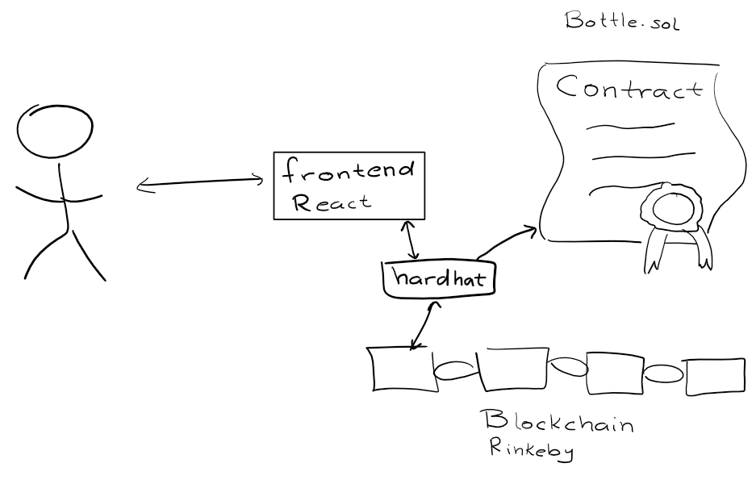

# Desafío Extrimian

La idea de la dapp que creé es implementar un mensaje en una botella descentralizado, donde cualquier puede leer el último mensaje ingresado y, si quisiera, modificarlo para la próxima persona. Este funcionamiento se ancla en un contrato inteligente muy simple, con una variable privada *message* y sus correspondientes getters y setters  que además logguean a consola. Efectivamente estamos usando el contrato como una capa de persistencia para nuestro mensaje en la botella, cosa que cualquiera con la dirección del contrato puede acceder a sus contenidos y modificarlos.

Primero creé un nuevo proyecto de React.js con `npx create-react-app`.

Luego inicié un nuevo proyecto de Hardhat dentro del mismo con `npx hardhat` y lo configuré para que use TypeScript y que utilice un nodo en la red local, lanzado con `npx hardhat node`. Además lo configuré para que los artefactos compilados, lése el contrato, se almacenen dentro de src/artifacts.

Una vez finalizado el contrato se debe deployear utilizando el script *deploy.ts* usando el comando `npx hardhat run scripts/deploy.ts --network localhost` y cargar a mano el address que se le asigna en la variable contractAddress en App.ts.

Desde el front end utilicé bootstrap para el styling y ethers.js para comunicarme con la blockchain. También usé Chai y Mocha para testing, si bien el grueso del testeo se realizó observando cómo cambiaban los campos en el front end. Para correr los tests podemos usar `npx hardhat test` Para poder hacer testing importé cuentas a MetaMask utilizando las credenciales default provistas por Hardhat al deployear el nodo. Lo que se debe hacer es agregar una cuenta en MetaMask utilizando la clave privada de alguna de estas cuentas default. A veces ocurrieron errores donde el nonce era inválido o el número de bloque no era el correcto, y eso radica de la pobre interacción entre MetaMask y el nodo local. Se puede solucionar borrando

Finalmente cambié la red donde reside el contrato para hacer testing en Rinkeby simplemente cambiando la network destino del contrato al deployearlo y utilicé mi cuenta con fondos para la testnet de Rinkeby en vez que las credenciales locales. Para obtener una url creé un proyecto usando Infura y, agregándolo junto con la clave privada de mi cuenta de testing en el hardhat.config.ts, tenemos la configuración válida para poder deployear en Rinkeby. Luego deployeamos usando el comando `hardhat run scripts/deploy.ts --network rinkeby` y tenemos el contrato en la testnet. Todo lo demás sigue funcionando de igual manera, simplemente hay que cambiar la red y cuenta en MetaMask.

La arquitectura básica del proyecto se detalla debajo
